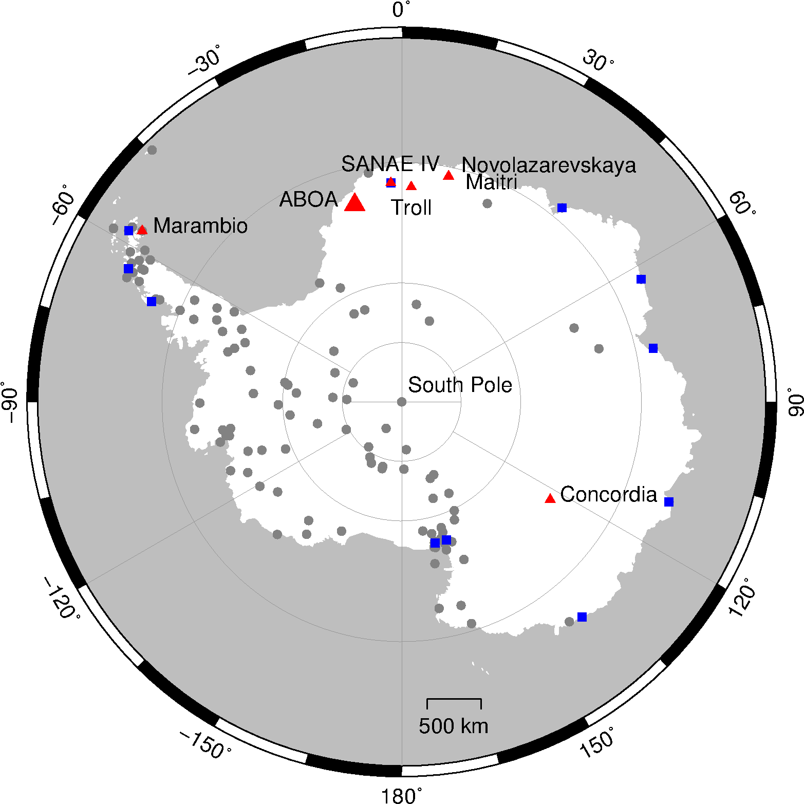

# aboa
GPS time time series for Aboa research station in Dronning Maud Land, East Antarctica

Full paper may be found here: http://bit.ly/aboagps

5000 daily PPP positions and 15-year long time series are also available. See the supplement material or [here](rs10121937/supplement).

  

